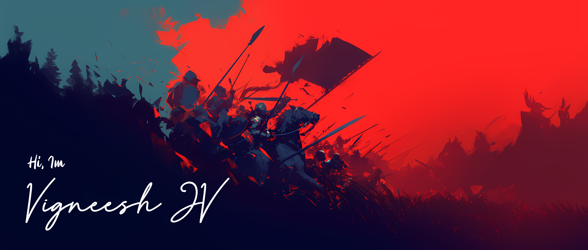

# Hi there, I'm JV Vigneesh! 👋

## 🚀 About Me
I am a **Mechanical Engineer turned Computer Science Enthusiast**, currently pursuing my **M.Tech in Computer Science and Engineering**. Passionate about **Java Full Stack Development, Cybersecurity, Web Development, and AI**, I love working on interdisciplinary projects that merge different fields of technology.

- 🔭 **Currently working on:** MTech (ADBMS, AML, IoT, IMG) Projects 
- 🎯 **Looking for:** Opportunities in **Full Stack Development**, **Cybersecurity**, or **AI-driven solutions** **etc.**  
- 💡 **Interests:** Software Engineering, Web Development, Ethical Hacking, Open Source Contributions  
- 🎮 **Hobbies:** Gaming, Exploring New Tech, Reading Comics, Watching Sci-Fi Movies  

## 🛠 Tech Stack

## 🚀 My Projects
- **[Gen Agritech Website](http://genagritech.com/)** 🌐 - Built a multi-page company website using **HTML, CSS, and VS Code**
- **3D Printed Robotic Arm** 🤖 - Designed and implemented a **Bluetooth-controlled robotic arm** using **Arduino & MG995 motors**
- **[Secure Password Manager](https://github.com/JV-Vigneesh/Secure-Password-Management-System)** 🔐 - A **JavaFX-based password manager** with **SHA-256 encryption and HashTable ADT**
- **[AI Powered Chatbot for Mental Health Support](https://github.com/JV-Vigneesh/AI-Powered-Chatbot-for-Mental-Health-Support)** 🤖 - AI-driven chatbot designed to provide mental health support using API & Predefined NLP
- **[Two Way ANNOVA Calculator](https://github.com/JV-Vigneesh/Two-Way-ANNOVA)** 🧮 - A Two-Way ANOVA Calculator using Python

## 📫 Connect with Me
        

---
🌟 **"Code, Create, Conquer!"** 🚀

---
